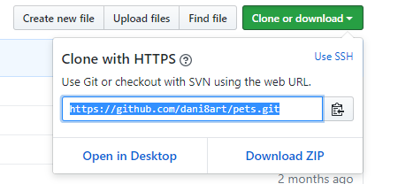

# Pets API documentation

1. [Deploy](#deploy)  
  1.1 [Locally](#locally)  
  1.2 [Docker](#deploydocker)  
  1.2 [Docker Compose](#deploydockercompose)  

## Deploy

### Locally 

> NOTE: YOU MUST HAVE A LOCALLY INSTALLATION OF [NODE JS](https://nodejs.org/es/download/package-manager/) AND [MONGO DB](https://docs.mongodb.com/manual/installation/) 

Download or clone this repo.

```javascript
git clone https://github.com/dani8art/pets.git
```



Install dependencies

```javascript
npm install
```

Run application

```javascript
npm start
```

### Docker

> NOTE: YOU MUST HAVE A LOCALLY INSTALLATION OF [DOCKER](https://docs.docker.com/engine/installation/)

First run a mongo container

```javascript
docker run -d --name mongodb mongo
```

Finally run a pets container

```javascript
docker run -d --name pets-container -e NODE_ENV=production -p 80:80 --link mongodb:mongodb darteaga/pets
```

You can also add initial data setting up an environment variable, adding to the above command this: 
`-e PETS_INITIAL_DATA=true`

### Docker Compose

> NOTE: YOU MUST HAVE A LOCALLY INSTALLATION OF [DOCKER](https://docs.docker.com/engine/installation/) AND [DOCKER-COMPOSE](https://docs.docker.com/compose/install/)

```javascript
docker-compose up -d
```